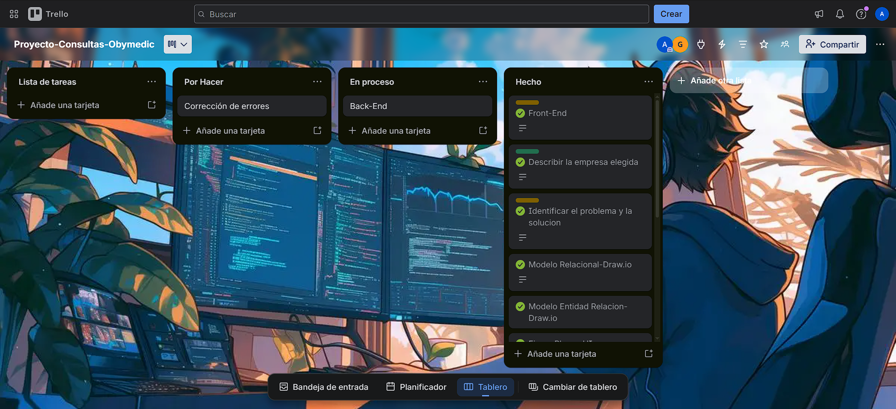
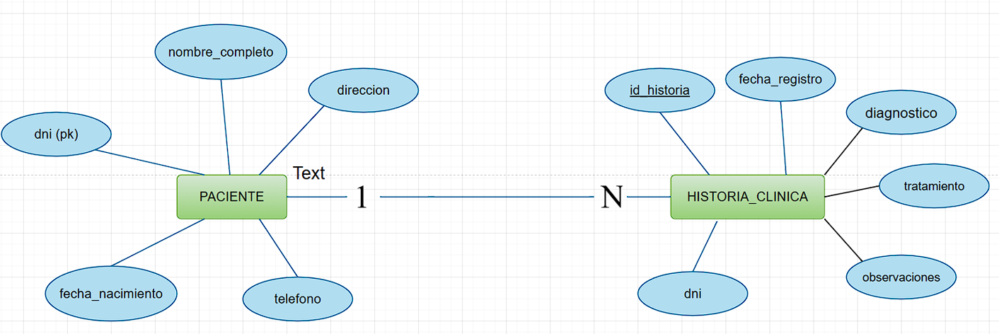
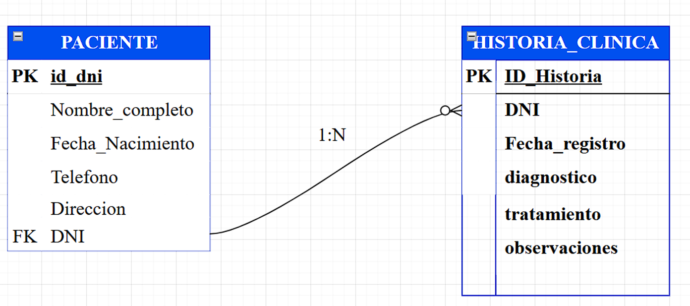
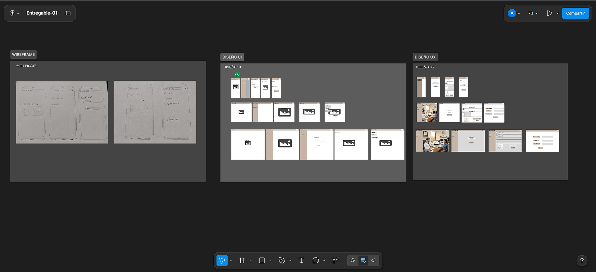

<head>
  <link href="https://fonts.googleapis.com/css2?family=Poppins:wght@300;400;600;700;800&family=Roboto+Mono:wght@400;500&display=swap" rel="stylesheet">
  <link rel="stylesheet" href="https://cdnjs.cloudflare.com/ajax/libs/font-awesome/6.5.1/css/all.min.css">
</head>

<div align="center" style="font-family: 'Poppins', sans-serif;">

# <i class="fas fa-heartbeat" style="color: #ff4757;"></i> SISTEMA DE GESTIÓN DE HISTORIAS CLÍNICAS <i class="fas fa-hospital-user" style="color: #1e90ff;"></i>
## <i class="fas fa-stethoscope"></i> OBYMEDIC - Obstetricia y Medicina

[](https://trello.com/invite/b/69bc3ede73d188581baa1482/ATTI3f827d0ff18d1e9bfddfe0ef1a6bd47a27F9FC1E/proyecto-consultas-obymedic)
[](https://www.figma.com/design/F0hS7gps6mz5811iBBZVr8/Entregable-01?node-id=1-2&t=1I4VFzDYAzfZAZIh-1)
[]()

</div>

---

## <i class="fab fa-trello" style="color: #0079bf;"></i> TRELLO
Más info en [mi tablero de trello](https://trello.com/invite/b/69bc3ede73d188581baa1482/ATTI3f827d0ff18d1e9bfddfe0ef1a6bd47a27F9FC1E/proyecto-consultas-obymedic)


---

# <i class="fas fa-rocket"></i> Sistema de Gestión de Historias Clínicas - Obstetricia y Medicina

<div align="center" style="font-family: 'Poppins', sans-serif;">
<i class="fas fa-laptop-medical"></i> Sistema web para la gestión de registros de historiales medicos de Obstetricia
</div>

---

## <i class="fas fa-clinic-medical"></i> Descripción del negocio

| Campo | Información |
|-------|-------------|
| <i class="fas fa-user-md"></i> **Nombre** | Alber Einstein Muñoz de la flor |
| <i class="fas fa-hospital"></i> **Consultorio Médico** | Obymedic |
| <i class="fas fa-id-card"></i> **RUC** | 10431624163 |
| <i class="fas fa-baby-carriage"></i> **Especialidad** | El consultorio brinda atención médica general y especialmente de Obstetricia |

---

## <i class="fas fa-exclamation-triangle"></i> Identificar el problema y solución

### <i class="fas fa-times-circle" style="color: #ff4757;"></i> Problema
Actualmente el médico registra los historiales médicos de manera manual (en físico), lo que genera:

- <i class="fas fa-clock"></i> Pérdida de tiempo al buscar información
- <i class="fas fa-file-alt"></i> Riesgo de extravío de documentos
- <i class="fas fa-folder-open"></i> Desorganización en los registros
- <i class="fas fa-search"></i> Dificultad para encontrar historiales por paciente
- <i class="fas fa-archive"></i> Acumulación de archivos físicos

### <i class="fas fa-check-circle" style="color: #2ed573;"></i> Solución tecnológica
Se desarrollará un Sistema Digital de Gestión de Historiales Médicos, el cual permitirá:

- <i class="fas fa-user-plus"></i> Registrar pacientes con su DNI
- <i class="fas fa-save"></i> Guardar múltiples historiales asociados a un mismo DNI
- <i class="fas fa-filter"></i> Implementar un filtro de búsqueda por DNI
- <i class="fas fa-chart-line"></i> Mostrar automáticamente los datos del paciente y fechas de atención
- <i class="fas fa-database"></i> Almacenar la información en una base de datos digital

---

## <i class="fas fa-list-check"></i> Requerimientos Funcionales

| <i class="fas fa-hashtag"></i> | Requerimiento | Descripcion |
|---|---|---|
| 1 | <i class="fas fa-user-plus"></i> Registrar paciente | El sistema debe permitir registrar pacientes utilizando su DNI |
| 2 | <i class="fas fa-user-edit"></i> Guardar datos del paciente | El sistema debe almacenar nombre completo, edad, teléfono y dirección del paciente |
| 3 | <i class="fas fa-notes-medical"></i> Registrar historial médico | El sistema debe permitir registrar un historial médico asociado al DNI del paciente |
| 4 | <i class="fas fa-file-medical"></i> Guardar información médica | El historial debe incluir fecha de atención, diagnóstico, tratamiento y observaciones |
| 5 | <i class="fas fa-search"></i> Búsqueda de paciente | El sistema debe permitir buscar pacientes mediante su DNI |
| 6 | <i class="fas fa-table-list"></i> Mostrar resultados | El sistema debe mostrar el nombre del paciente y las fechas de sus historiales médicos |
| 7 | <i class="fas fa-eye"></i> Ver detalle del historial | El sistema debe mostrar el nombre del paciente y las fechas de sus historiales médicos |
| 8 | <i class="fas fa-pen"></i> Editar historial médico | El sistema debe permitir modificar o actualizar la información del historial médico |

---

## <i class="fas fa-microchip"></i> Requerimientos No Funcionales

| <i class="fas fa-gem"></i> | Requerimiento | Descripcion |
|---|---|---|
| <i class="fas fa-hand-peace"></i> | Facilidad de uso | El sistema debe tener una interfaz sencilla y fácil de usar |
| <i class="fas fa-shield-alt"></i> | Seguridad | El acceso al sistema debe realizarse mediante usuario y contraseña |
| <i class="fas fa-database"></i> | Almacenamiento seguro | La información debe almacenarse en una base de datos segura |
| <i class="fas fa-tachometer-alt"></i> | Rendimiento | El sistema debe responder a las búsquedas en menos de 3 segundos |

---

## <i class="fas fa-layer-group"></i> Stack completo

1. <i class="fab fa-trello"></i> Trello = Gestión del proyecto (Kanban)
2. <i class="fas fa-draw-polygon"></i> Draw.io = Diagrama ER + Diagrama de Clases
3. <i class="fab fa-figma"></i> Figma = Wireframe + Diseño UI/UX
4. <i class="fas fa-database"></i> MySQL Workbench = Diseñar y administrar BD
5. <i class="fas fa-code"></i> IntelliJ = Frontend (HTML,CSS,JS) + Backend (Spring Boot)
6. <i class="fas fa-server"></i> XAMPP = Servidor Tomcat para correr la app

---

## <i class="fas fa-microchip"></i> Tecnologias utilizadas

- <i class="fab fa-java"></i> Java 17
- <i class="fas fa-leaf"></i> Spring Boot 3
- <i class="fas fa-database"></i> MySQL 8
- <i class="fab fa-html5"></i> HTML5, <i class="fab fa-css3-alt"></i> CSS3, <i class="fab fa-js"></i> JavaScript
- <i class="fas fa-code"></i> IntelliJ IDEA
- <i class="fas fa-server"></i> XAMPP (Tomcat)
- <i class="fas fa-database"></i> MySQL Workbench
- <i class="fab fa-figma"></i> Figma (diseño UI/UX)
- <i class="fas fa-draw-polygon"></i> Draw.io (diagramas)

---

## <i class="fas fa-folder-tree"></i> Estructura del proyecto

```
📂 JavaWeb-GotaGota/
├── 📁 backend/          → Spring Boot (Java)
│   ├── 📁 src/
│   ├── 📄 pom.xml
│   └── ...
├── 📁 frontend/         → HTML, CSS, JS
│   ├── 📁 css/
│   ├── 📁 js/
│   └── 📄 interfaz.html
```

---

## <i class="fas fa-database"></i> Base de datos

El sistema cuenta con 2 tablas principales:

| <i class="fas fa-table"></i> Tabla | Descripcion |
|---|---|
| <i class="fas fa-users"></i> PACIENTE | Consulta si el cliente tiene un registro previo |
| <i class="fas fa-notes-medical"></i> HISTORIAL_CLINICA | Registra el historial clinico y lo guarda en la base de datos |

### <i class="fas fa-project-diagram"></i> Diagrama Entidad-Relacion (DER)


### <i class="fas fa-share-alt"></i> Modelo Relacional (MR)


### <i class="fab fa-figma"></i> DIAGRAMA DE FIGMA

Más info en [Mi_Diseño_Figma](https://www.figma.com/design/F0hS7gps6mz5811iBBZVr8/Entregable-01?node-id=1-2&t=1I4VFzDYAzfZAZIh-1)



### <i class="fas fa-code"></i> Script de Base de datos

```sql
CREATE DATABASE obymedic;
USE obymedic;

-- =========================
-- TABLA PACIENTES
-- =========================
CREATE TABLE pacientes (
    id_paciente BIGINT AUTO_INCREMENT PRIMARY KEY,
    
    nombre_apellidos VARCHAR(150) NOT NULL,
    dni VARCHAR(8) NOT NULL UNIQUE,
    
    telefono VARCHAR(20),
    direccion VARCHAR(150),
    distrito VARCHAR(100),
    provincia VARCHAR(100),

    fecha_nacimiento VARCHAR(20),
    edad INT,

    created_at TIMESTAMP DEFAULT CURRENT_TIMESTAMP,
    updated_at TIMESTAMP DEFAULT CURRENT_TIMESTAMP ON UPDATE CURRENT_TIMESTAMP
);

-- =========================
-- TABLA CONSULTAS
-- =========================
CREATE TABLE consultas (
    id_consulta BIGINT AUTO_INCREMENT PRIMARY KEY,

    id_paciente BIGINT NOT NULL,

    fecha DATE,
    motivo VARCHAR(255),
    edad INT,

    pa VARCHAR(20),
    fc VARCHAR(20),
    fr VARCHAR(20),
    temperatura VARCHAR(20),
    peso DOUBLE,
    talla DOUBLE,
    spo2 VARCHAR(10),

    diagnostico TEXT,
    tratamiento TEXT,
    examenes_auxiliares TEXT,

    proxima_cita DATE,
    firma_sello VARCHAR(150),
    atencion_por VARCHAR(150),

    created_at TIMESTAMP DEFAULT CURRENT_TIMESTAMP,
    updated_at TIMESTAMP DEFAULT CURRENT_TIMESTAMP ON UPDATE CURRENT_TIMESTAMP,

    -- RELACION CON PACIENTES
    CONSTRAINT fk_paciente
    FOREIGN KEY (id_paciente)
    REFERENCES pacientes(id_paciente)
    ON DELETE CASCADE
);
```

---

## <i class="fas fa-play-circle"></i> Como correr el proyecto

### <i class="fas fa-check-double"></i> Requisitos previos
- <i class="fas fa-check-circle" style="color: #2ed573;"></i> Tener instalado IntelliJ IDEA
- <i class="fas fa-check-circle" style="color: #2ed573;"></i> Tener instalado XAMPP (para MySQL)
- <i class="fas fa-check-circle" style="color: #2ed573;"></i> Tener instalado MySQL Workbench
- <i class="fas fa-check-circle" style="color: #2ed573;"></i> Tener instalado JDK 21 o superior

### <i class="fas fa-server"></i> Backend
1. <i class="fas fa-folder-open"></i> Abrir la carpeta `backend/` en IntelliJ IDEA
2. <i class="fas fa-sliders-h"></i> Configurar `application.properties` con los datos de MySQL
3. <i class="fas fa-play"></i> Iniciar XAMPP y activar MySQL
4. <i class="fas fa-play-circle"></i> Ejecutar `GotagotaApplication.java`
5. <i class="fas fa-check"></i> El backend corre en: `http://localhost:8080`

### <i class="fas fa-laptop-code"></i> Frontend
1. <i class="fas fa-folder-open"></i> Abrir la carpeta `frontend/` en VsCode
2. <i class="fas fa-globe"></i> Abrir `index.html` con Live Server
3. <i class="fas fa-exchange-alt"></i> El frontend se comunica con el backend via fetch()

> <i class="fas fa-exclamation-triangle" style="color: #ffa502;"></i> **IMPORTANTE:** El frontend y el backend corren por separado.
> <i class="fas fa-bell" style="color: #ff4757;"></i> **El backend debe estar iniciado antes de abrir el frontend**

### <i class="fas fa-tools"></i> Configuracion de base de datos

```properties
spring.application.name=obymedic

#CONEXION A MYSQL
spring.datasource.url=jdbc:mysql://localhost:3306/obymedic
spring.datasource.username=root
spring.datasource.password=
spring.datasource.driver-class-name=com.mysql.cj.jdbc.Driver

# JPA / HIBERNATE
spring.jpa.hibernate.ddl-auto=update
spring.jpa.show-sql=true
spring.jpa.database-platform=org.hibernate.dialect.MySQLDialect

# PUERTO
server.port=8080
```

---

## <i class="fas fa-user-md"></i> Autor

**<i class="fas fa-star-of-life"></i> Alber Einstein Muñoz de la flor** - Consultorio OBYMEDIC

---

<div align="center">

<i class="fas fa-star" style="color: #ffd32a;"></i> <i class="fas fa-star" style="color: #ffd32a;"></i> <i class="fas fa-star" style="color: #ffd32a;"></i> <i class="fas fa-star" style="color: #ffd32a;"></i> <i class="fas fa-star" style="color: #ffd32a;"></i>

## ⭐ ¡Gracias por visitar este proyecto! ⭐

<i class="fab fa-github"></i> <i class="fab fa-linkedin"></i> <i class="fab fa-twitter"></i> <i class="fab fa-instagram"></i>

</div>
